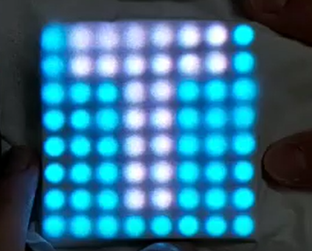

# Project: 俄羅斯方塊
## Authors: 107321014劉怡君  107321026黃姵馨

Function:
  old:	(1)隨機出現一種方塊
	(2)新的方塊碰到以堆疊好的方塊或底部會停止下降
	(3)下落中的方塊可左右移動，加速和轉向
	(4)橫排填滿時會消掉，上面方塊向下填補。
	(5)堆疊方塊碰到頂部時結束遊戲
	
  new:  (1)計時(分:秒)
  	(2)計分每消除一橫排加一分
	
Equipment:
	LCD begin picture:
	
	
	LCD playing game's picture:
	![image]8x8LED_game.png
	
	16-bits LCD to count point
	![image]16-bitsLED.png
	
	7 Segment display
	![image]Seven-segment.png
	
Video:

